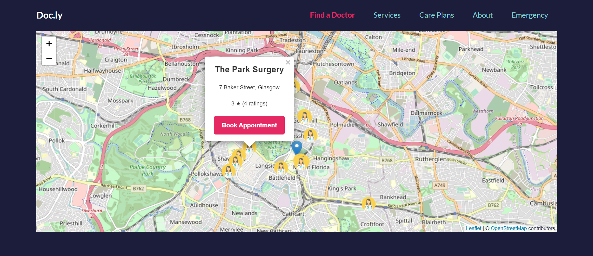
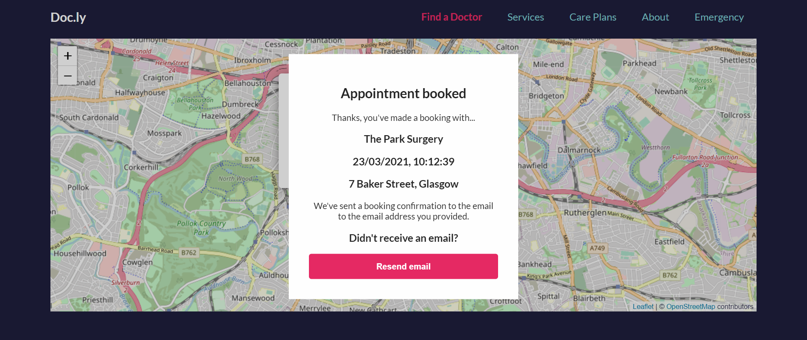

# Phlo Technical Challenge

I create the application using [Create React App](https://github.com/facebook/create-react-app).

**Note**: this was my first time using React, so feel free to point me any possible improvements/best practices that I could have missed :)
It was definitely a good learning experience on my side.

## Get the app running

Clone the repo and run the usual `npm install`.

In the project directory, run: `npm run build`.
This will create the build folder with all the static assets.

Insert your Google Places API key in _/server/config.js_.

Then run `npm start`.
This will start the Express server which should serve the static assets on localhost:8080/.

I didn't consider using Nodemon or something similar to reload the server as there is no much logic in there anyway.

For development, I used the CRA dev-server to have hot-reloading.

## What could be improved

### Server side logic

I didn't think it was part of the spec to develop a full end-to-end app with a database for storage, extensive rest API design ect.

Definitely a lot more work would be needed to implement that: sending emails, not allowing conflicting appointments at the same time and much more.

### Design

I used some styling from Phlo website and I didn't spend much time on it. I could probably make it better with a little more time.

### Date Time Picker

I didn't wanted to spend quite some time looking for a date time picker so I choose one quickly to get going. Further investigations and UI tests could be done. A custom solution would required more dev time.

### Accessiblity and more browser testing

For production, more developer testing would be required: accessibility by going through the user flow using keyboard only for example.

I tried testing the app in different browsers: Chrome, Edge and Firefox. I am not using a Mac so not thats straightforward to test Safari for me.

### Better user experience

Right now, the app requests the user to share his location. We could imagine that a user could be asked to enter his postcode if the permission was refused.

In that case we could use public open API's for geocoding like this one: http://api.getthedata.com/postcode/g11eb or even Google's one: https://developers.google.com/maps/documentation/geocoding/overview.

### More error handling

I tried to handle a few error cases, but haven't done it for all the possible ones. Needed to be production ready.

# Thank you for you time!
